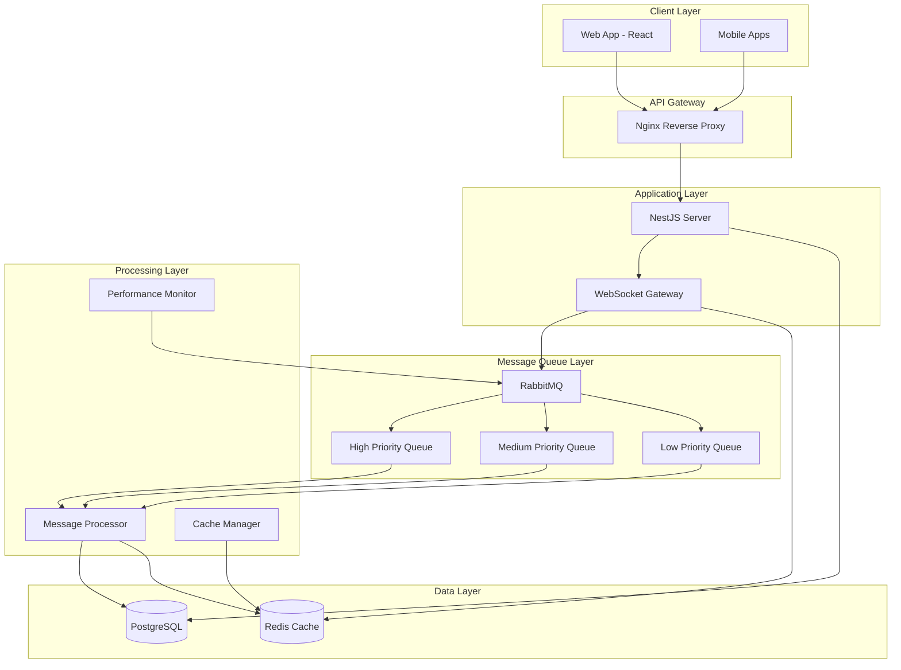
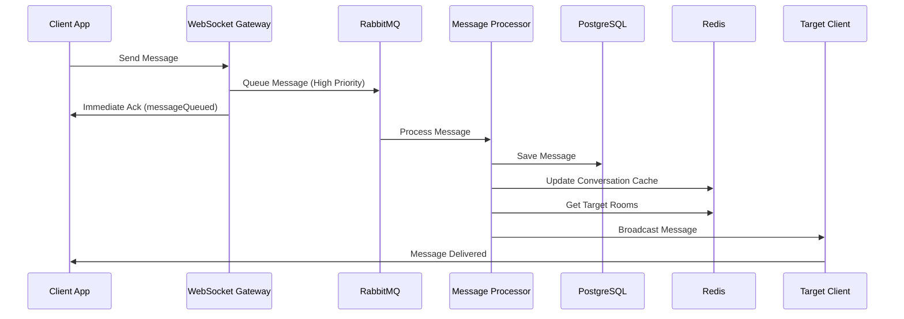
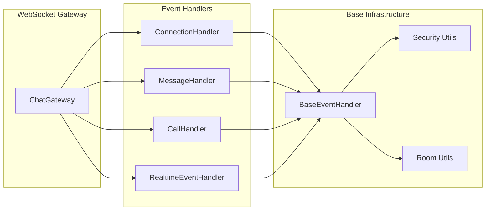
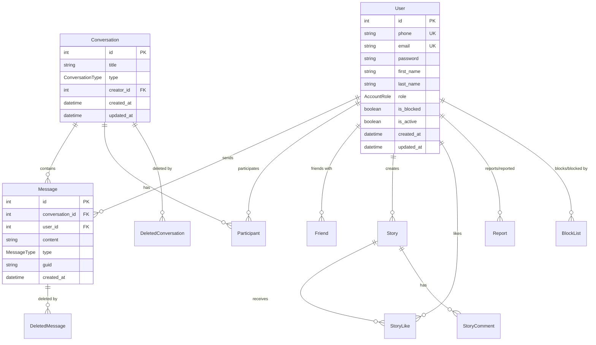
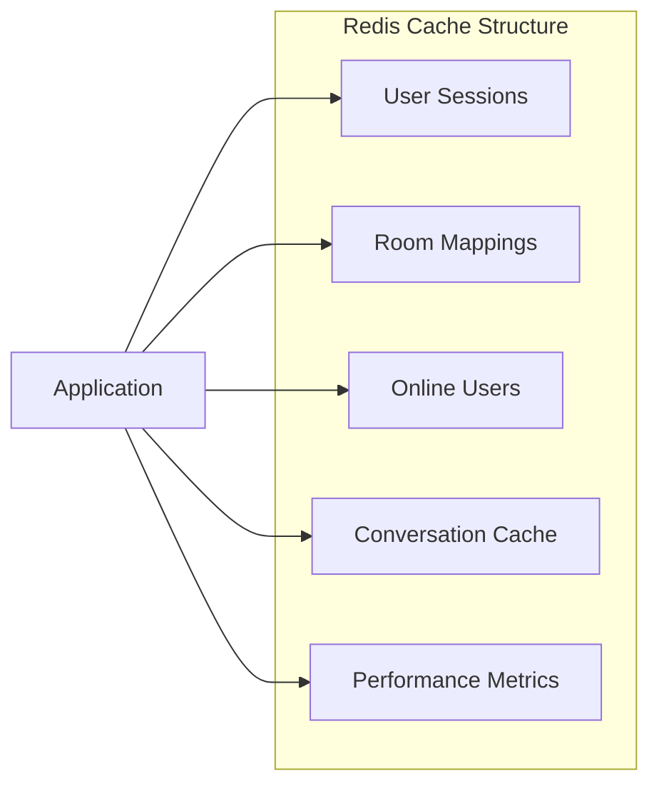

# 💬 ChatChit - Real-time Communication Platform

<div align="center">


[](https://nestjs.com/)
[](https://reactjs.org/)
[](https://www.typescriptlang.org/)
[](https://www.postgresql.org/)
[](https://redis.io/)
[](https://www.rabbitmq.com/)
[](https://www.docker.com/)

*A modern, scalable real-time communication platform inspired by Telegram, built with enterprise-grade architecture*

</div>

## Table of Contents

- [Overview](#overview)
- [Core Architecture](#core-architecture)
  - [WebSocket Gateway System](#-websocket-gateway-system)
  - [High-Performance Message Queue](#-high-performance-message-queue)
  - [Redis Caching Layer](#-redis-caching-layer)
- [Key Features](#key-features)
  - [Real-time Communication](#-real-time-communication)
  - [Social Features](#-social-features)
  - [Security & Authentication](#-security--authentication)
  - [Performance & Monitoring](#-performance--monitoring)
- [Technology Stack](#technology-stack)
- [Architectural Benefits](#architectural-benefits)
- [Performance Metrics](#performance-metrics)
- [Deployment & Infrastructure](#deployment--infrastructure)
- [Development Features](#development-features)
- [Migration & Refactoring History](#migration--refactoring-history)
---

## 🌟 Overview

**ChatChit** is a full-stack real-time communication platform that delivers seamless messaging, voice/video calling, and social features. Built with modern technologies and enterprise-grade architecture, it's designed to handle high-concurrency scenarios while maintaining excellent user experience.

### ✨ Key Features

🚀 **Real-time Messaging** - Instant message delivery with Socket.IO and WebSocket technology  
📞 **Voice & Video Calls** - WebRTC-powered high-quality calls with signaling support  
👥 **Group Conversations** - Multi-user chat rooms with member management  
📱 **Cross-Platform** - Responsive design working seamlessly on desktop and mobile  
🔐 **Secure Authentication** - JWT-based auth with refresh token mechanism  
📊 **User Presence** - Real-time online/offline status and typing indicators  
📸 **Rich Media** - Image, file sharing with emoji picker integration  
👫 **Friend Management** - Send/accept friend requests, block users  
📖 **Stories Feature** - Share temporary stories with likes and comments  
🔔 **Real-time Notifications** - Instant notifications for messages and calls  
⚡ **High Performance** - Queue-based architecture with Redis caching  

---

## 🏗️ System Architecture

### High-Level Architecture Diagram



### Real-time Communication Flow



### Event Handler Architecture



---

## 🚀 Technology Stack

### Backend Technologies
- **NestJS** - Progressive Node.js framework with TypeScript
- **Socket.IO** - Real-time bidirectional event-based communication
- **PostgreSQL** - Primary database with Prisma ORM
- **Redis** - Caching and session management
- **RabbitMQ** - Message queue for scalable event processing
- **JWT** - Authentication and authorization
- **Prisma** - Type-safe database client and schema management

### Frontend Technologies  
- **React 18** - Modern UI library with hooks
- **TypeScript** - Type-safe JavaScript development
- **Tailwind CSS** - Utility-first CSS framework
- **Socket.IO Client** - Real-time communication
- **React Router** - Client-side routing
- **Axios** - HTTP client for API requests

### DevOps & Infrastructure
- **Docker** - Containerization for all services
- **Docker Compose** - Multi-container orchestration
- **Nginx** - Reverse proxy and load balancing
- **PgAdmin** - PostgreSQL administration
- **Redis Commander** - Redis management interface

---

## 📊 Database Schema

### Core Entity Relationships



---

## ⚡ Performance Features

### Queue-Based Message Processing

The application uses **RabbitMQ** with priority queues to handle high-frequency events efficiently:

- **High Priority Queue** (8-10): Messages, calls, critical operations
- **Medium Priority Queue** (5): Group operations, message deletions  
- **Low Priority Queue** (1-3): Typing indicators, presence updates

### Redis Caching Strategy



### Horizontal Scaling Points

- **Multiple Queue Consumers** - Scale based on message load
- **Redis Clustering** - Distribute cache across nodes  
- **Load-Balanced Gateways** - Multiple WebSocket servers
- **Database Sharding** - Partition by user/conversation

---

## 🔧 Installation & Setup

### Prerequisites

- **Node.js** 18+ 
- **Docker** & **Docker Compose**
- **Git**

### Quick Start with Docker

```bash
# Clone the repository
git clone https://github.com/Realtime-Communication/chat-chit.git
cd chat-chit

# Start all services with Docker Compose
cd docker
cp env.example .env
docker-compose up -d

# The application will be available at:
# - Frontend: http://localhost:3000
# - Backend API: http://localhost:8080
# - PgAdmin: http://localhost:5050
# - RabbitMQ Management: http://localhost:15672
```

### Development Setup

#### Backend Setup

```bash
cd realtime-server

# Install dependencies
npm install

# Setup environment
cp env.example .env

# Start development database
docker-compose -f docker-compose.dev.yml up -d

# Run database migrations
npx prisma migrate dev

# Seed database with sample data
npx prisma db seed

# Start development server
npm run dev
```

#### Frontend Setup

```bash
cd chat-chit-fe

# Install dependencies
npm install

# Setup environment
cp env.example .env

# Start development server
npm start
```

---

## 🎯 API Endpoints

### Authentication Endpoints
```
POST /auth/login          # User login
POST /auth/register       # User registration  
POST /auth/refresh        # Refresh JWT token
POST /auth/logout         # User logout
```

### Chat Endpoints
```
GET /chat/conversations   # Get user conversations
POST /chat/conversations  # Create new conversation
GET /chat/messages/:id    # Get conversation messages
POST /chat/messages       # Send message
DELETE /chat/messages/:id # Delete message
```

### User Management
```
GET /users/profile        # Get user profile
PUT /users/profile        # Update profile
GET /users/friends        # Get friends list
POST /users/friends       # Send friend request
PUT /users/friends/:id    # Accept/reject friend request
```

### Real-time Events (WebSocket)
```
sendMessage               # Send chat message
deleteMessage            # Delete message
callUser                 # Initiate voice/video call
answerCall               # Answer incoming call
typing                   # Typing indicator
messageRead              # Mark message as read
joinGroup                # Join group conversation
```

---

## 🔐 Security Features

### Authentication & Authorization
- **JWT Tokens** with refresh mechanism
- **Role-based Access Control** (User, Admin)
- **Rate Limiting** to prevent spam and abuse
- **Input Validation** and sanitization

### WebSocket Security
- **Token-based Authentication** for WebSocket connections
- **Room-based Authorization** ensuring users can only access permitted conversations
- **Rate Limiting** on WebSocket events
- **CORS Configuration** for cross-origin requests

### Data Protection
- **Password Hashing** with bcrypt
- **SQL Injection Prevention** with Prisma ORM
- **XSS Protection** with input sanitization
- **User Blocking** and reporting system

---

## 📈 Monitoring & Performance

### Built-in Monitoring Features

- **Queue Depth Monitoring** - Real-time queue statistics
- **Processing Rate Tracking** - Events per second metrics
- **Performance Scoring** - Automated system health assessment  
- **Connection Health** - WebSocket connection monitoring
- **Error Tracking** - Comprehensive error logging

### Health Check Endpoints
```
GET /health               # Basic health check
GET /health/detailed      # Detailed system status
GET /metrics             # Performance metrics
```

---

## 🚀 Deployment

### Production Docker Deployment

```bash
# Clone and setup
git clone https://github.com/Realtime-Communication/chat-chit.git
cd chat-chit/docker

# Configure production environment
cp env.example .env
# Edit .env with production values

# Deploy with Docker Compose
docker-compose -f docker-compose.yml up -d

# Setup SSL certificates (optional)
docker-compose -f docker-compose.yml -f docker-compose.ssl.yml up -d
```

### Environment Variables

```bash
# Database Configuration
POSTGRES_HOST=localhost
POSTGRES_PORT=5432
POSTGRES_USER=admin
POSTGRES_PASSWORD=your_password
POSTGRES_DB=realtime_chat

# Redis Configuration  
REDIS_HOST=localhost
REDIS_PORT=6379
REDIS_PASSWORD=your_redis_password

# JWT Configuration
JWT_ACCESS_TOKEN=your_jwt_secret
JWT_ACCESS_EXPIRED=7d
JWT_REFRESH_TOKEN=your_refresh_secret
JWT_REFRESH_EXPIRED=30d

# RabbitMQ Configuration
RABBITMQ_USER=admin
RABBITMQ_PASSWORD=your_rabbitmq_password

# Application Configuration
PORT=8080
NODE_ENV=production
CORS_ORIGINS=https://yourdomain.com
```

---

## 🧪 Testing

### Running Tests

```bash
# Backend tests
cd realtime-server
npm test                  # Unit tests
npm run test:e2e         # End-to-end tests
npm run test:cov         # Coverage report

# Frontend tests  
cd chat-chit-fe
npm test                 # React component tests
npm run test:coverage    # Coverage report
```

### Test Coverage Areas
- **Unit Tests** - Service layer and utilities
- **Integration Tests** - API endpoints and database operations
- **WebSocket Tests** - Real-time event handling
- **Component Tests** - React component functionality
- **E2E Tests** - Full user workflows

---

## 🤝 Contributing

We welcome contributions! Please follow these steps:

1. **Fork** the repository
2. **Create** a feature branch (`git checkout -b feature/amazing-feature`)
3. **Commit** your changes (`git commit -m 'Add some amazing feature'`)
4. **Push** to the branch (`git push origin feature/amazing-feature`)
5. **Open** a Pull Request

### Development Guidelines
- Follow **TypeScript** best practices
- Write **comprehensive tests** for new features
- Update **documentation** for API changes
- Use **conventional commits** for commit messages
- Ensure **code quality** with ESLint and Prettier

---

## 📝 License

This project is licensed under the **MIT License** - see the [LICENSE](LICENSE) file for details.

---

## 👥 Team

**ChatChit Development Team**
- Backend Architecture: NestJS + PostgreSQL + Redis + RabbitMQ
- Frontend Development: React + TypeScript + Tailwind CSS
- DevOps: Docker + Nginx + Monitoring Stack

---

## 🔗 Links

- **Repository**: [GitHub](https://github.com/Realtime-Communication/chat-chit)
- **Documentation**: [Wiki](https://github.com/Realtime-Communication/chat-chit/wiki)
- **Issues**: [Bug Reports](https://github.com/Realtime-Communication/chat-chit/issues)
- **Discussions**: [Community](https://github.com/Realtime-Communication/chat-chit/discussions)

---

## 📞 Support

Need help? Here's how to get support:

- 📧 **Email**: support@chatchit.com
- 💬 **Discord**: [Join our community](https://discord.gg/chatchit)
- 📚 **Documentation**: [Read the docs](https://docs.chatchit.com)
- 🐛 **Bug Reports**: [GitHub Issues](https://github.com/Realtime-Communication/chat-chit/issues)

---

<div align="center">

**Made with ❤️ by the ChatChit Team**

⭐ **Star this repo if you find it helpful!** ⭐

</div>
